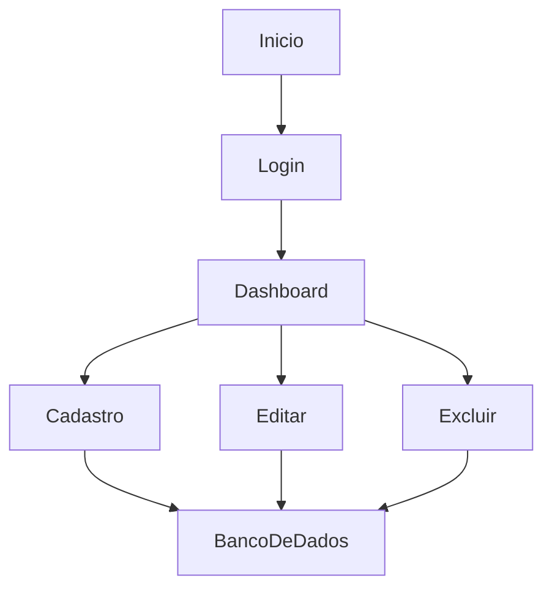
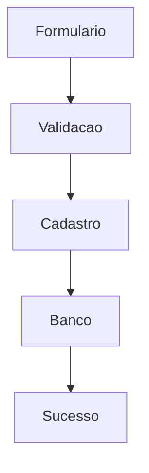
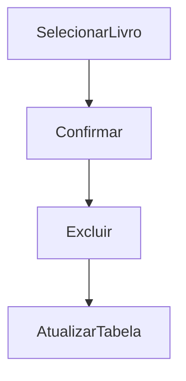

# Documentação de Especificações de Requisito de Software (SRS)

## Sistema de Gerenciamento de Biblioteca — BookHub

**Versão:** 1.0.0

**Data:** 2026-05-28

**Autor:** Pedro Lanaro

**Protótipo:** [Link do Protótipo no Figma](https://www.figma.com/design/yHnwXPfZUMfKSKwJA8UfO0/BookHub?node-id=0-1&t=XBhpA4iAZF40JAAq-1)

---

# 1. Introdução

## 1.1 Propósito

Este documento apresenta os requisitos do sistema **BookHub**, desenvolvido para gerenciamento de livros em uma biblioteca.

O documento tem como objetivo:

* definir as funcionalidades do sistema;
* organizar o desenvolvimento;
* servir como base para implementação e testes.

---

## 1.2 Escopo

O sistema permitirá:

* cadastro de livros;
* edição de livros;
* exclusão de livros;
* visualização do acervo;
* pesquisa de livros;
* controle de disponibilidade.

O sistema será desenvolvido como aplicação web utilizando:

* HTML
* CSS
* JavaScript
* PHP
* PostgreSQL

---

## 1.3 Definições

| Termo      | Definição                          |
| ---------- | ---------------------------------- |
| Livro      | Item cadastrado no sistema         |
| Acervo     | Conjunto de livros registrados     |
| Disponível | Livro disponível para empréstimo   |
| Emprestado | Livro indisponível temporariamente |

### Acrônimos

* **SGB** — Sistema de Gerenciamento de Biblioteca
* **RF** — Requisito Funcional
* **RNF** — Requisito Não Funcional

---

# 2. Descrição Geral do Sistema

## 2.1 Perspectiva do Sistema

O sistema será uma aplicação web executada em navegador.

O usuário poderá acessar páginas para:

* cadastrar livros;
* editar livros;
* remover livros;
* visualizar informações.

---

## 2.2 Funções do Sistema

O sistema deve:

* cadastrar livros;
* listar livros;
* editar livros;
* excluir livros;
* pesquisar livros por autor;
* alterar status do livro.

---

## 2.3 Classes de Usuários

| Usuário       | Descrição          |
| ------------- | ------------------ |
| Bibliotecário | Gerencia o acervo  |
| Usuário       | Consulta os livros |

---

## 2.4 Ambiente Operacional

* Navegador Web
* Banco de Dados MySQL/PostgreSQL

---

## 2.5 Restrições

* Sistema local
* Necessário banco de dados
* Sem login avançado

---

## 2.6 Suposições

* Usuário possui conhecimentos básicos de informática
* Banco de dados configurado corretamente

---

# 3. Requisitos do Sistema

## 3.1 Requisitos Funcionais

---

### RF-001 — Cadastro de Livros

**Descrição:** Permitir cadastrar livros no sistema.

### Critérios de Aceitação

* [ ] Inserção de título
* [ ] Inserção de autor
* [ ] Inserção de gênero
* [ ] Inserção do ano de publicação
* [ ] Definição do status do livro
* [ ] Cadastro salvo no banco

---

### RF-002 — Listagem de Livros

**Descrição:** Exibir todos os livros cadastrados.

### Critérios de Aceitação

* [ ] Mostrar tabela de livros
* [ ] Exibir título, autor, gênero e status
* [ ] Atualizar automaticamente após cadastro

---

### RF-003 — Edição de Livros

**Descrição:** Permitir editar livros cadastrados.

### Critérios de Aceitação

* [ ] Buscar livro pelo ID
* [ ] Alterar informações
* [ ] Atualizar no banco de dados
* [ ] Exibir mensagem de sucesso

---

### RF-004 — Exclusão de Livros

**Descrição:** Permitir excluir livros cadastrados.

### Critérios de Aceitação

* [ ] Selecionar livro
* [ ] Confirmar exclusão
* [ ] Remover do banco
* [ ] Atualizar listagem

---

### RF-005 — Busca de Livros

**Descrição:** Permitir pesquisar livros por autor.

### Critérios de Aceitação

* [ ] Campo de pesquisa
* [ ] Busca por autor
* [ ] Exibição dos resultados

---

### RF-006 — Controle de Status

**Descrição:** Permitir alterar status do livro.

### Critérios de Aceitação

* [ ] Status disponível
* [ ] Status emprestado
* [ ] Atualização visual do status

---

## 3.2 Requisitos Não Funcionais

---

### RNF-001 — Usabilidade

Interface simples e intuitiva.

---

### RNF-002 — Desempenho

Respostas rápidas inferiores a 1 segundo.

---

### RNF-003 — Responsividade

Sistema adaptável para diferentes tamanhos de tela.

---

### RNF-004 — Organização

Separação dos arquivos por funcionalidade.

---

### RNF-005 — Validação

Validação obrigatória dos dados inseridos.

---

# 4. Regras de Negócio

| Código | Regra                             |
| ------ | --------------------------------- |
| RN-001 | O título do livro é obrigatório   |
| RN-002 | O autor é obrigatório             |
| RN-003 | O ano deve ser válido             |
| RN-004 | Todo livro deve possuir status    |
| RN-005 | Exclusão deve possuir confirmação |

---

# 5. Estrutura do Sistema

## 5.1 Páginas do Sistema

| Página        | Função                 |
| ------------- | ---------------------- |
| login.php     | Tela de login          |
| index.php     | Dashboard principal    |
| cadastrar.php | Cadastro de livros     |
| editar.php    | Edição de livros       |
| excluir.php   | Exclusão de livros     |
| conexao.php   | Conexão com banco      |
| style.css     | Estilização do sistema |

---

## 5.2 Fluxo do Sistema



---

## 5.3 Fluxo de Cadastro



---

## 5.4 Fluxo de Exclusão



---

# 6. Banco de Dados

## 6.1 Tabela Livros

```sql id="0s7sh8"
CREATE TABLE livros (
    id INT AUTO_INCREMENT PRIMARY KEY,
    titulo VARCHAR(150),
    autor VARCHAR(100),
    genero VARCHAR(50),
    ano_publicacao INT,
    status_livro VARCHAR(20)
);
```

---

# 7. Interface do Sistema

O sistema possui interface moderna baseada em dashboard administrativo.

Características visuais:

* sidebar lateral;
* navbar superior;
* cards informativos;
* tabelas organizadas;
* formulários minimalistas;
* tema em azul escuro.

---

# 8. Controle de Versões

| Versão | Data       | Autor | Modificação    |
| ------ | ---------- | ----- | -------------- |
| 1.0.0  | 2026-05-28 | Pedro Lanaro  | Versão Inicial |